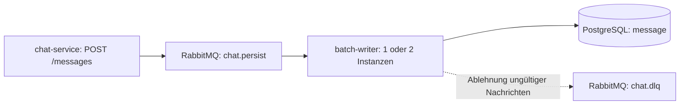

# Spezifikation: batch-writer

**M321 · Bewertung 1 · Stand 30.09.2026**

**Status: Vor der Implementierung erstellt; umgesetzt und nach Auditkorrekturen am 30.09.2026 erneut selbst geprüft.**
Dieses Dokument beschreibt das Soll-Verhalten; die gemessenen Ergebnisse stehen im
[Abnahmebericht](abnahme-batch-writer.md). Spezifikation und Umsetzungsplan wurden
in dieser Reihenfolge vor dem Code separat committet. Die Lehrperson hatte laut
Rückmeldung des Lernenden zur Weiterarbeit aufgefordert; ein Vorzeigen oder eine
formelle Lehrerrückmeldung wird nicht als bereits erfolgt behauptet.

## 1. Zweck und Abgrenzung

Der batch-writer übernimmt Nachrichten aus RabbitMQ und speichert sie dauerhaft
in PostgreSQL. Mehrere Nachrichten werden gemeinsam in einer Transaktion
geschrieben. Ein kurzzeitiger Datenbankausfall darf keine gültige Nachricht verlieren.



Die bestehenden Dienste bleiben erhalten. Hinzu kommen die Compose-Dienste
`batch-writer` und `postgres` im Netz `chat-net`. Kein Dienst veröffentlicht
einen Host-Port. Prüfwerkzeuge greifen aus diesem Netz oder über
`docker compose exec` zu.

Nicht Teil dieser Bewertung: Chat-Historie lesen, Räume/Mitgliedschaften verwalten,
Keycloak, Gateway, Web-/Desktop-UI und ein eigener load-generator.
`roomId` wird trotzdem gespeichert, weil es zum Nachrichtenvertrag gehört.
Die allgemeine Lastannahme von 100'000 Nachrichten/Minute begründet Batching;
sie wird hier nicht als bereits erreichte oder zusätzlich nachzuweisende Rate behauptet.

Grundlage sind die acht Szenarien der Bewertungsunterlage vom 24.09.2026 und
der bereitgestellte Quelltext auf Basis von Commit `f8ea557`.
Bei Widersprüchen hat der konkrete Bewertungsauftrag Vorrang vor dem Gesamtentwurf
in [PLANUNG.md](../PLANUNG.md).

## 2. Nachrichtenvertrag und Belege

### 2.1 Transport

| Eigenschaft | Vertrag |
|---|---|
| Queue | `chat.persist`, VHost `/` |
| Body | Ein JSON-Objekt pro AMQP-Nachricht, UTF-8 |
| Erforderliche AMQP-Eigenschaft | `content_type: application/json`; UTF-8 als optionaler Charset-Parameter zulässig |
| Java-Header | Weder `__TypeId__` noch andere Java-Typinformationen erforderlich; vorhandene Typheader werden ignoriert |
| Identität | Die UUID in `id`, nicht AMQP-delivery-tag, AMQP-message-id oder Inhalt |
| Zustellweg | `chat.delivery` gehört nicht zum Writer |

Belege im vorhandenen Dienst:

- [ChatMessage.java](../chat-service/src/main/java/ch/benedict/m321/chatservice/dto/ChatMessage.java):
  sechs Felder und deren Java-Typen.
- [SendMessageRequest.java](../chat-service/src/main/java/ch/benedict/m321/chatservice/dto/SendMessageRequest.java):
  Eingabefelder, Pflichtwerte und nicht leere Texte.
- [MessageService.java](../chat-service/src/main/java/ch/benedict/m321/chatservice/service/MessageService.java):
  vergibt UUID und Serverzeit; übernimmt die vier Eingabefelder.
- [MessagePublisher.java](../chat-service/src/main/java/ch/benedict/m321/chatservice/service/MessagePublisher.java):
  veröffentlicht auf Schreib- und Zustellweg.
- [RabbitConfig.java](../chat-service/src/main/java/ch/benedict/m321/chatservice/config/RabbitConfig.java)
  und [QueueNames.java](../chat-service/src/main/java/ch/benedict/m321/chatservice/config/QueueNames.java):
  JSON-Konverter, Queue-Namen und Dead-Letter-Konfiguration.

Der Writer liest den JSON-Body in einen eigenen Daten-record. Es gibt keine
Abhängigkeit auf die Java-Klassen des chat-service und kein gemeinsames DTO-Modul.
Die Compose-Abnahme über POST /messages prüft zusätzlich das tatsächlich
erzeugte Publisher-JSON auf dem vollständigen Weg bis in die Datenbank.

### 2.2 Inhalt

| Feld | JSON-Typ | Prüfung und Bedeutung |
|---|---|---|
| `id` | String | Pflichtfeld, vollständige UUID-Schreibweise; Wert unverändert übernehmen |
| `roomId` | String | Pflichtfeld, vollständige UUID-Schreibweise; keine Raumabfrage |
| `senderId` | String | Pflichtfeld, nicht leer/blank; unverändert übernehmen |
| `senderName` | String | Pflichtfeld, nicht leer/blank; unverändert übernehmen |
| `content` | String | Pflichtfeld, nicht leer/blank; Zeilenumbrüche und Umlaute zulässig |
| `sentAt` | String | Pflichtfeld, ISO-8601-Zeitpunkt mit Zeitzone, als Instant im unten festgelegten Speicherbereich lesbar |

Zusätzliche JSON-Felder werden ignoriert. Fehlende/null-Felder, falsche Feldtypen,
ungültiges JSON und ungültige UUIDs/Zeitpunkte werden abgelehnt. Texte müssen
gültigen Unicode enthalten; U+0000 wird abgelehnt, weil PostgreSQL es in Textspalten
nicht speichern kann. Es wird keine zusätzliche fachliche Maximallänge erfunden,
die der vorhandene Producer nicht vorgibt. Broker- und Speichergrenzen bleiben bestehen.

Für `sentAt` gilt einschliesslich beider Grenzen der UTC-Bereich
`-4712-01-01T00:00:00Z` bis `+294276-12-31T23:59:59.999999Z`.
Die untere Grenze entspricht 4713 vor Christus: Der verwendete JDBC-Treiber
wandelt frühere OffsetDateTime-Werte in `-infinity` um. Die obere Grenze ist die
letzte endliche Mikrosekunde von PostgreSQL. Werte darüber werden vor JDBC abgelehnt, damit
auch eine Rundung auf Mikrosekunden nicht in das nächste, unzulässige Jahr führt.
Java kann weiter entfernte Zeitpunkte lesen; diese sind für unseren Speichervertrag
ungültig und gelangen einzeln in `chat.dlq`. Gültige Nachbarn bleiben verarbeitbar.
Innerhalb des Bereichs bleibt die übliche Mikrosekundenrundung beim Speichern bestehen.
[PostgreSQL 16: genaue Timestamp-Grenzen](https://github.com/postgres/postgres/blob/REL_16_STABLE/src/include/datatype/timestamp.h),
[pgJDBC 42.7.11: Zeitkonvertierung](https://github.com/pgjdbc/pgjdbc/blob/REL42.7.11/pgjdbc/src/main/java/org/postgresql/jdbc/TimestampUtils.java),
[Datentyp und Präzision](https://www.postgresql.org/docs/16/datatype-datetime.html).

Beispiel eines Queue-Bodys, mit absichtlich fester ID für den Duplikattest:

```json
{
  "id": "11111111-1111-4111-8111-111111111111",
  "roomId": "22222222-2222-4222-8222-222222222222",
  "senderId": "anna",
  "senderName": "Anna Muster",
  "content": "Hallo zusammen",
  "sentAt": "2026-09-29T08:00:00Z"
}
```

Beim HTTP-Aufruf von `POST /messages` fehlen `id` und `sentAt`: der
chat-service erzeugt sie. Zwei HTTP-Aufrufe sind deshalb zwei verschiedene
Nachrichten. S5 muss dieselbe bereits identifizierte Nachricht direkt auf die
Queue legen.

## 3. Verarbeitung und Zustellgarantie

### 3.1 Normalfall

1. Ein Consumer sammelt bis zu 100 Nachrichten. Bei geringer Last wird auch ein
   unvollständiger Batch verarbeitet; es wird nicht auf eine weitere Nachricht gewartet.
2. Jede Nachricht wird einzeln gelesen und validiert. Ungültige Nachrichten werden
   einzeln abgelehnt; gültige Nachbarn bleiben verarbeitbar.
3. Alle gültigen Nachrichten dieses Batches werden mit parametrisierten
   JDBC-Batch-Operationen in **einer** PostgreSQL-Transaktion geschrieben.
4. Die Transaktion wird vollständig bestätigt (COMMIT).
5. Erst danach erhält RabbitMQ ACK für die betreffenden Nachrichten.
   Ein Batch ohne gültige Nachrichten öffnet keine DB-Transaktion.

ACK-Modus ist `MANUAL`. Bestätigungen/Ablehnungen erfolgen pro Nachricht mit
`multiple=false` auf dem Kanal der Zustellung. Damit kann eine Bestätigung
keine zuvor abgelehnte oder noch nicht gespeicherte Nachricht miterfassen.
Die Datenbank bleibt trotzdem pro Batch transaktional; einzelne ACKs sind keine
einzelnen DB-Transaktionen.

Spring AMQP sammelt die Nachrichten auf Consumer-Seite. Vorgesehen sind
`consumerBatchEnabled=true`, `batchSize=100`, `prefetchCount=100` und
genau ein Consumer je Instanz. Die Sammelzeit wird durch `batchReceiveTimeout=200`
Millisekunden begrenzt; `receiveTimeout=50` Millisekunden erlaubt einen frühen
Abschluss bei leerer Queue. Ein laufender Empfang und Scheduling können die
nominelle Zeit etwas überschreiten. Die harten Abnahmegrenzen bleiben 60 bzw. 90 Sekunden.
So braucht es keinen eigenen Timer-Thread und keinen gemeinsam veränderbaren Puffer.
[Spring AMQP: Consumer-Batches](https://docs.spring.io/spring-amqp/reference/3.2/amqp/receiving-messages/batch.html),
[API: Zeitbegrenzung seit Version 3.1.2](https://docs.spring.io/spring-amqp/api/org/springframework/amqp/rabbit/listener/SimpleMessageListenerContainer.html#setBatchReceiveTimeout(long)).

Bei einem vorliegenden Rückstau von 1000 Nachrichten sind mit vollen
100er-Batches ungefähr zehn Schreibtransaktionen zu erwarten. Entscheidend für
S4 ist die Messung von höchstens 100 Transaktionen, nicht diese Modellrechnung.
`batchUpdate` allein ersetzt keine ausdrücklich gesetzte Transaktionsgrenze.

### 3.2 Fehlerfälle

| Fall | Verhalten | Begründung |
|---|---|---|
| Writer ist gestoppt | Nachrichten warten in chat.persist; Start verarbeitet den Rückstau | Entkopplung von Annahme und Speicherung |
| Gleiche ID wird erneut zugestellt | INSERT mit `ON CONFLICT (id) DO NOTHING`; anschliessend ACK | Duplikate sind kein Fehler und gehören nicht in die DLQ |
| Gleiche ID mit anderem Inhalt | Bereits gespeicherter Datensatz bleibt unverändert | ID bestimmt Identität; keine nachträgliche Überschreibung |
| PostgreSQL nicht erreichbar oder Transaktion scheitert | Kein ACK; Rollback soweit möglich; 1000 ms Pause, danach NACK mit requeue für alle gültigen Nachrichten des Batches | Gültige Nachrichten behalten, keine schnelle Wiederholungsschleife |
| Ausfall während COMMIT, Ergebnis unklar | Wie Datenbankfehler behandeln und erneut zustellen lassen | Ein eventuell schon erfolgter COMMIT wird durch Idempotenz unschädlich |
| Dauerhafter technischer DB-Fehler, etwa fehlende Tabelle/Rechte | Gleiches Wiederholungsverhalten und ERROR-Log; keine automatische Löschung/DLQ für gültige Daten | Betreiber muss den Fehler beheben; versteckte Verluste vermeiden |
| Ungültiges JSON, Feldwert oder Content-Type | Einzelnes NACK ohne requeue; Broker leitet nach chat.dlq; keine DB-Zeile | Derselbe unveränderte Inhalt würde erneut scheitern |
| Writer stirbt vor COMMIT | Offene DB-Transaktion rollt zurück; nicht bestätigte Nachrichten werden erneut geliefert | Kein ACK für ungespeicherte Daten |
| Writer stirbt nach COMMIT, vor ACK | Erneute Zustellung; Primärschlüssel verhindert zweite Zeile | DB und Broker haben keine gemeinsame Transaktion |
| Broker/Kanal fällt beim ACK/NACK aus | Keine Bestätigung auf einem neuen Kanal mit alten delivery-tags; Verbindung erholt sich, unbestätigte Nachrichten werden erneut geliefert | delivery-tags gelten nur auf ihrem Kanal |
| Prozess wird beendet | Consumer stoppt; nicht abgeschlossene Arbeit bleibt unbestätigt | Neustart kann sie übernehmen |

Bei Datenbankfehlern gibt es bewusst **keine feste maximale Versuchszahl**.
Während des Ausfalls liegen Nachrichten entweder bereit in der Queue oder
unbestätigt beim Consumer. Der Puffer ist durch prefetch begrenzt.
Nach Wiederherstellung der Datenbank arbeitet derselbe Writer-Prozess weiter.

**Festlegung für S7:** Alle 300 gültigen Nachrichten sollen in `message`
ankommen, ohne Zuwachs in `chat.dlq` und ohne Writer-Neustart. Der Nachweis unten
misst konservativ höchstens 90 Sekunden ab dem Stoppen von PostgreSQL;
PostgreSQL wird nach 15 Sekunden wieder gestartet.

Die vorhandene Queue bleibt durable, ohne TTL oder neue Längenbegrenzung.
Ihre Argumente bleiben `x-dead-letter-exchange=""` und
`x-dead-letter-routing-key="chat.dlq"`. Auch chat.dlq bleibt durable.
Ungültige Nachrichten werden nicht automatisch aus der DLQ gelöscht oder erneut gesendet.

Die Garantie gilt für gültige Nachrichten, die RabbitMQ auf chat.persist bereits
übernommen hat, solange Broker-/DB-Daten erhalten bleiben.
Der Writer verarbeitet **at least once mit idempotenter Speicherung**.
Er garantiert kein globales Exactly-once, keine Reihenfolge über mehrere Instanzen
und keine Atomarität der zwei Publish-Aufrufe des vorhandenen Producers.
Ein HTTP-202 ist keine Bestätigung einer dauerhaften DB-Speicherung.
[RabbitMQ: Consumer-Bestätigungen](https://www.rabbitmq.com/docs/3.13/confirms).

## 4. Datenmodell und Schema

Die Tabelle heisst `public.message`; die Spalten entsprechen PLANUNG.md §3.7.

| Spalte | PostgreSQL-Typ | Regel |
|---|---|---|
| id | uuid | PRIMARY KEY |
| room_id | uuid | NOT NULL |
| sender_id | varchar ohne Längenbegrenzung | NOT NULL |
| sender_name | varchar ohne Längenbegrenzung | NOT NULL |
| content | text | NOT NULL |
| sent_at | timestamptz | NOT NULL |

Zusätzlich: Index `message_room_sent_at_idx` auf `(room_id, sent_at DESC)`,
wie im Gesamtentwurf für den späteren Lesepfad vorgesehen. Der Writer bietet
diesen Lesepfad nicht an. Der Primärschlüssel stellt die Eindeutigkeit auch
bei zwei gleichzeitigen Writer-Instanzen sicher.
[PostgreSQL: ON CONFLICT](https://www.postgresql.org/docs/16/sql-insert.html).

Kein Fremdschlüssel für room_id: Raumverwaltung ist ausdrücklich ausgeschlossen;
auch beliebige gültige Raum-UUIDs des Prüfskripts müssen gespeichert werden.
Benutzer werden nicht in einer zusätzlichen Tabelle verwaltet.
Der Zeitwert wird als Zeitpunkt übernommen; PostgreSQL speichert Mikrosekunden,
während Instant feinere Auflösung haben kann. Tests berücksichtigen diese Präzision
und vergleichen keine formatierten Zeitzonen-Zeichenketten.

Schemaquelle ist `batch-writer/src/main/resources/schema.sql`.
Compose bindet diese Datei schreibgeschützt als
`/docker-entrypoint-initdb.d/001-message.sql` in den PostgreSQL-Container ein.
Damit initialisiert PostgreSQL die Datenbank einmal, bevor die Writer starten;
zwei Writer konkurrieren nicht um DDL. Integrationstests verwenden dieselbe Schemaquelle.

Das Init-Skript läuft nur mit einem leeren Datenverzeichnis.
Vorhandene Daten werden beim Neustart nicht gelöscht oder automatisch migriert.
Schemaänderungen an bestehenden Daten brauchen später eine ausdrückliche Migration.
Das genügt für den geforderten frischen Klon und das feste Schema dieser Bewertung.
[Offizielles PostgreSQL-Image: Initialisierung](https://hub.docker.com/_/postgres).

## 5. Betrieb und Konfiguration

### 5.1 Festgelegte Grundlage

Java 21, Spring Boot 3.5.16 aus dem vorhandenen Eltern-POM,
Spring AMQP, Spring JDBC/JdbcTemplate, PostgreSQL 16, RabbitMQ 3.13,
Maven, JUnit und Testcontainers. Kein JPA und kein zusätzliches Spring-Batch-Framework.

Der Queue-Listener ist der Eingang; ein Service besitzt die Transaktionsgrenze;
ein Repository kapselt SQL. Das erfüllt die Trennung der Verantwortlichkeiten
ohne HTTP-Router oder View im Writer. Konkrete Klassen und Implementierungsschritte
gehören in den anschliessenden Umsetzungsplan.

### 5.2 Umgebungsvariablen

Alle vom Projekt verwendeten Variablen werden in .env.example dokumentiert.
Compose reicht sie ausdrücklich an die jeweiligen Dienste weiter; .env bleibt lokal.

| Variable | Beispiel/Standard | Verwendung |
|---|---|---|
| RABBITMQ_USER | chat | Broker, chat-service, Writer |
| RABBITMQ_PASSWORD | bitte-lokal-aendern | Dieselben Dienste; nicht leer |
| RABBITMQ_HOST | rabbitmq | Interner Broker-Hostname für Java-Dienste |
| POSTGRES_USER | chat | Initialisierung und DB-Verbindung |
| POSTGRES_PASSWORD | bitte-lokal-aendern | Initialisierung und Writer; nicht leer |
| POSTGRES_DB | chat | Anwendungsdatenbank; für die Messung verschieden von postgres |
| POSTGRES_HOST | postgres | Interner DB-Hostname für den Writer |
| BATCH_SIZE | 100 | Maximaler Batch und prefetch; positive ganze Zahl |
| BATCH_TIMEOUT_MS | 200 | Nominelle maximale Sammelzeit; positive ganze Zahl |
| RETRY_DELAY_MS | 1000 | Pause vor erneuter Zustellung bei DB-Fehler; positive ganze Zahl |

Die Abnahme erfolgt mit diesen Batch-Standardwerten.
Die Beispielpasswörter dienen nur dem lokalen Unterrichtsstack.

Feste Einstellungen, keine weiteren projektspezifischen Umgebungsvariablen:
AMQP-Port 5672, DB-Port 5432, VHost /, ein Consumer und höchstens eine aktive
DB-Verbindung je Writer. Empfangswartezeit ist `min(50, BATCH_TIMEOUT_MS)` ms.
Hikari-Verbindungswartezeit: 2000 ms; minimale Leerlaufverbindungen: 0.
`initialization-fail-timeout=-1` verhindert einen Startabbruch des Pools bei
nicht erreichbarer DB; die eigentlichen Schreibversuche melden den Fehler weiterhin.
JDBC-`connectTimeout=2` und `socketTimeout=5` Sekunden verhindern ein
unbegrenztes Warten bei Verbindungsfehlern. Die Retry-Pause folgt auf den
fehlgeschlagenen DB-Versuch; sie ist nicht dessen gesamte Laufzeit.
[pgJDBC: Verbindungs- und Lesetimeouts](https://jdbc.postgresql.org/documentation/use/).

Der Writer startet keine Webanwendung und keine HTTP-Schnittstelle.
Er führt kein Spring-SQL-Init aus, da PostgreSQL das Schema initialisiert.
Keine automatischen Prozessneustarts sollen einen Fehler in S7 verdecken.

### 5.3 Compose und Persistenz

- PostgreSQL-Image `postgres:16-alpine`; Datenvolume `postgres-data` nach
  `/var/lib/postgresql/data`.
- Vorhandenes RabbitMQ-Image `rabbitmq:3.13-management`; Volume
  `rabbitmq-data` nach `/var/lib/rabbitmq`; stabiler Hostname `rabbitmq`,
  damit der Broker nach Containerneuerstellung dieselben Daten wiederfindet.
- Der Writer wartet beim ersten Compose-Start auf gesunden Broker und PostgreSQL.
  Der Broker-Healthcheck prüft den aktiven AMQP-Listener auf Port 5672;
  ein erfolgreicher Ping der Erlang-Laufzeit allein genügt nicht.
  Der PostgreSQL-Healthcheck nutzt TCP auf localhost, damit der temporäre
  Initialisierungsserver nicht vorzeitig Bereitschaft meldet.
- Keine `ports:`-Einträge. Die Management-API des Brokers bleibt intern.
- Kein fester `container_name` beim Writer; Skalierung mit
  `docker compose up -d --scale batch-writer=2`.
- Nach einem DB-Ausfall ist kein neues `compose up` für den Writer erforderlich.
- Root-`mvn clean test` muss alle Module einschliessen.
  Beide Java-Docker-Builds müssen mit der erweiterten Eltern-Modulliste funktionieren.

Logs sind auf Englisch und nennen Batchgrösse, Ergebnis und Fehlerursache.
Passwörter und vollständige Chat-Inhalte werden nicht protokolliert.
Code auf Englisch; Kommentare, Javadoc, Dokumentation und Commit-Messages auf Deutsch.
Jede Klasse und Methode bekommt einen erklärenden Kommentar gemäss
[CLAUDE.md](../CLAUDE.md); keine Streams oder unnötigen Abstraktionen.

## 6. Messbare Abnahme

### 6.1 Gemeinsame Regeln

S1–S8 werden in dieser Reihenfolge geprüft. Zwischen S2 und S8 werden weder
Queues geleert noch Tabellen/Volumes gelöscht. Jede Sendeserie bekommt eine
neue Raum-UUID; geprüft werden die tatsächlich zurückgegebenen Nachrichten-IDs.
Dadurch stören Datensätze vorheriger Szenarien nicht.

Die folgenden Befehle beschreiben die eigene Abnahme, nicht das unbekannte
Prüfskript des Lehrers. Die Hilfsfunktionen wurden am lokalen Compose-Stack
erprobt und korrigiert; die eigene Abnahme erfolgte erstmals am 29.09.2026 und
nach den Korrekturen erneut am 30.09.2026. S2–S7 liefen dabei auf frischen lokalen
Klonen; Ort und Code-Stand des jeweiligen S1-Laufs stehen im Abnahmebericht. Messergebnisse stehen in
[abnahme-batch-writer.md](abnahme-batch-writer.md).
Voraussetzung für die Beispiele: PowerShell 7, Java 21, Maven und laufendes Docker.
Befehle im Projektstamm ausführen. SQL und HTTP bleiben innerhalb von Docker.

Die Hilfsfunktionen sind ausschliesslich Messbefehle in dieser Spezifikation.
Sie sind keine vorgezogene Implementierung des Writers oder eines Lastdienstes.
Den folgenden Block einmal in derselben PowerShell-Sitzung ausführen:

```powershell
$ErrorActionPreference = 'Stop'

# Führt SQL im DB-Container aus und bricht bei einem SQL-Fehler ab.
function Invoke-ChatSql([string]$Sql) {
    $result = $Sql | docker compose exec -T postgres sh -c 'exec psql -X -At -v ON_ERROR_STOP=1 -U "$POSTGRES_USER" -d "$POSTGRES_DB"'
    if ($LASTEXITCODE -ne 0) { throw 'SQL-Abfrage fehlgeschlagen.' }
    return $result
}

# Liest Queue-Zustände, ohne Nachrichten aus der Queue zu entfernen.
function Get-QueueState([string]$Name) {
    $output = docker compose exec -T rabbitmq rabbitmqctl list_queues --formatter=json name messages_ready messages_unacknowledged consumers
    if ($LASTEXITCODE -ne 0) { throw 'Queue-Abfrage fehlgeschlagen.' }
    $queues = ($output -join "`n") | ConvertFrom-Json
    foreach ($queue in $queues) {
        if ($queue.name -eq $Name) { return $queue }
    }
    throw "Queue fehlt: $Name"
}

# Sendet eine Serie innerhalb des Netzes; gibt die vom Server erzeugten IDs zurück.
function Send-Messages([guid]$RoomId, [int]$Count) {
    $sendScript = @'
set -eu
room="$1"
count="$2"
index=1
while [ "$index" -le "$count" ]; do
    body=$(printf '{"roomId":"%s","senderId":"acceptance","senderName":"Acceptance Test","content":"Message %s"}' "$room" "$index")
    curl --silent --show-error --fail-with-body --max-time 5 \
        -H 'Content-Type: application/json' --data-binary "$body" \
        http://chat-service:8080/messages
    printf '\n'
    index=$((index + 1))
done
'@
    # PowerShell unter Windows liefert CRLF; die Linux-Shell erwartet LF.
    $responses = @($sendScript | docker run --rm -i --network chat-net --entrypoint sh curlimages/curl:8.10.1 -c 'tr -d "\r" | sh -s -- "$@"' -- $RoomId $Count)
    if ($LASTEXITCODE -ne 0) { throw 'Sendeserie fehlgeschlagen; keine automatische Wiederholung.' }
    if ($responses.Count -ne $Count) { throw 'Unerwartete Anzahl HTTP-Antworten.' }
    foreach ($line in $responses) {
        $response = $line | ConvertFrom-Json
        $messageId = [guid]$response.id
        $messageId.ToString()
    }
}

# Wartet begrenzt auf genau die erwarteten IDs und eine vollständig abgearbeitete Queue.
function Wait-ForMessages([guid]$RoomId, [string[]]$Ids, [int]$Seconds) {
    $quotedIds = @()
    foreach ($id in $Ids) {
        $messageId = [guid]$id
        $quotedIds += "'$messageId'"
    }
    $idList = $quotedIds -join ','
    $expected = "$($Ids.Count)|$($Ids.Count)"
    $watch = [System.Diagnostics.Stopwatch]::StartNew()
    while ($watch.Elapsed.TotalSeconds -lt $Seconds) {
        $counts = Invoke-ChatSql "SELECT count(*), count(*) FILTER (WHERE id IN ($idList)) FROM message WHERE room_id = '$RoomId';"
        $queue = Get-QueueState 'chat.persist'
        if ($counts -eq $expected -and $queue.messages_ready -eq 0 -and $queue.messages_unacknowledged -eq 0) {
            if ($watch.Elapsed.TotalSeconds -gt $Seconds) { break }
            return
        }
        Start-Sleep -Seconds 2
    }
    throw "Nachrichten oder Queue nach $Seconds Sekunden nicht im Sollzustand."
}

# Misst aus der Wartungsdatenbank, damit die Messabfrage nicht selbst in chat zählt.
function Get-TransactionCount {
    $sql = "SELECT xact_commit + xact_rollback FROM pg_stat_database WHERE datname = :'target_database';"
    $result = $sql | docker compose exec -T postgres sh -c 'exec psql -X -At -v ON_ERROR_STOP=1 -v target_database="$POSTGRES_DB" -U "$POSTGRES_USER" -d postgres'
    if ($LASTEXITCODE -ne 0) { throw 'Transaktionsmessung fehlgeschlagen.' }
    if ([string]::IsNullOrWhiteSpace($result)) { throw 'Datenbankstatistik fehlt.' }
    return [long]$result
}
```

Die kleinen curl-Container sind vorübergehende Prüfwerkzeuge, keine zusätzlichen
Compose-Dienste. Das Image vor den Zeitmessungen laden:
`docker pull curlimages/curl:8.10.1`.
Die Queue-Abfrage prüft ausdrücklich auch unbestätigte Nachrichten.
Die SQL-Abfrage zählt sowohl alle Zeilen des neuen Raums als auch die erwarteten
IDs; fehlende Nachrichten und zusätzliche Zeilen führen damit zum Fehlschlag.

### S1 – Vollständiger Testlauf

```powershell
mvn clean test
if ($LASTEXITCODE -ne 0) { throw 'S1 fehlgeschlagen.' }
```

Erwartet: ein erfolgreicher Lauf vom Projektstamm, keine übersprungenen
erforderlichen Tests. Der Writer hat Integrationstests mit echtem RabbitMQ und
PostgreSQL, insbesondere für Duplikat ohne Typheader und Datenbankausfall.
Mocks allein belegen S5 und S7 nicht.

### S2 – Frischer Klon und interner Stack

Nach Veröffentlichung des fertigen Standes in einem neuen Prüfverzeichnis:

```powershell
git clone --branch main https://github.com/Igor4g/it3c-m321.git it3c-m321-abnahme
Set-Location it3c-m321-abnahme
Copy-Item .env.example .env
docker compose up -d --build
docker compose ps
$containerIds = @(docker compose ps -q)
docker inspect --format '{{.Name}} {{.State.Status}} {{json .HostConfig.PortBindings}}' $containerIds
docker compose exec -T postgres sh -c 'psql -X -U "$POSTGRES_USER" -d "$POSTGRES_DB" -c "\d message"'
```

Erwartet: rabbitmq, chat-service, postgres und batch-writer laufen; Broker/DB
werden healthy; keine Host-Portbindung (PortBindings leer/null).
Die Tabelle und der Index existieren. Es gibt keine manuell angelegten Dateien
ausser der Kopie von .env.example. Kein bestehender Stack darf gleichzeitig das
fest benannte Netz chat-net benutzen. Danach im selben Prüfverzeichnis bleiben
und die Hilfsfunktionen aus Abschnitt 6.1 laden.

### S3 – 1000 Nachrichten

```powershell
$roomId = [guid]::NewGuid()
$messageIds = @(Send-Messages $roomId 1000)
Wait-ForMessages $roomId $messageIds 60
```

Erwartet: alle 1000 zurückgegebenen IDs einmal gespeichert; chat.persist hat
0 ready und 0 unacknowledged. Die Grenze wird ab Ende der Sendeserie gemessen.
Die Feldwerte einschliesslich Inhalt und Zeitpunkt werden zusätzlich im
Integrationstest mit dem Producer-Vertrag verglichen.

### S4 – Rückstau und höchstens 100 Transaktionen

```powershell
docker compose stop batch-writer
$roomId = [guid]::NewGuid()
$messageIds = @(Send-Messages $roomId 1000)
$backlog = Get-QueueState 'chat.persist'
if ($backlog.messages_ready -ne 1000 -or $backlog.messages_unacknowledged -ne 0 -or $backlog.consumers -ne 0) {
    throw 'S4: Rückstau oder gestoppter Writer nicht nachgewiesen.'
}
Start-Sleep -Seconds 2
$before = Get-TransactionCount
docker compose start batch-writer
Wait-ForMessages $roomId $messageIds 60
# Nach abgeschlossener Verarbeitung die DB-Verbindung sauber schliessen,
# damit noch lokale Backend-Statistik im Endwert enthalten ist.
docker compose stop batch-writer
if ($LASTEXITCODE -ne 0) { throw 'S4: Writer-Stop zur Statistikabgabe fehlgeschlagen.' }
try {
    Start-Sleep -Seconds 2
    $after = Get-TransactionCount
} finally {
    docker compose start batch-writer
    if ($LASTEXITCODE -ne 0) { throw 'S4: Writer-Neustart fehlgeschlagen.' }
}
$transactionDelta = $after - $before
$transactionDelta
if ($transactionDelta -le 0 -or $transactionDelta -gt 100) {
    throw 'S4: Transaktionszahl ausserhalb des erwarteten Bereichs.'
}
```

Vor dem Start müssen die 1000 neuen Nachrichten bereitliegen, ohne Consumer.
Danach alle IDs vorhanden und Queue leer. Die eigene 60-s-Grenze dient hier
als zusätzlicher Testabbruch; die Unterlage nennt bei S4 keine eigene Zeitgrenze.

Die Differenz enthält auch Abnahme-SELECTs und sonstige Transaktionen der
Anwendungsdatenbank. Es wird nichts pauschal abgezogen; höchstens 100 insgesamt
ist ein konservativer Nachweis. Keine parallelen fremden DB-Nutzer während der Messung.
Nach leerer Queue wird der Writer für den Endwert kurz sauber gestoppt und
anschliessend wieder gestartet. Dadurch endet seine DB-Sitzung und noch lokale
Statistik wird veröffentlicht. Eine blosse Wartezeit von zwei Sekunden ergab
im ersten Versuch einen unvollständigen Wert. Es werden weder Daten noch
Statistikzähler zurückgesetzt. Das Ergebnis wird zusätzlich auf Plausibilität geprüft.
[PostgreSQL: xact_commit und xact_rollback](https://www.postgresql.org/docs/16/monitoring-stats.html).

### S5 – Identisches JSON zweimal, ohne Java-Header

```powershell
$roomId = [guid]::NewGuid()
$messageId = [guid]::NewGuid()
$message = @{
    id = $messageId.ToString()
    roomId = $roomId.ToString()
    senderId = 'acceptance'
    senderName = 'Acceptance Test'
    content = 'Duplicate check'
    sentAt = '2026-09-29T08:00:00Z'
}
$payload = $message | ConvertTo-Json -Compress
$publication = @{
    properties = @{ content_type = 'application/json' }
    routing_key = 'chat.persist'
    payload = $payload
    payload_encoding = 'string'
} | ConvertTo-Json -Depth 4 -Compress

$deadBefore = Get-QueueState 'chat.dlq'
for ($i = 0; $i -lt 2; $i++) {
    $reply = $publication | docker run --rm -i --network chat-net --env-file .env --entrypoint sh curlimages/curl:8.10.1 -c 'exec curl --silent --show-error --fail-with-body --max-time 5 -u "$RABBITMQ_USER:$RABBITMQ_PASSWORD" -H "Content-Type: application/json" --data-binary @- http://rabbitmq:15672/api/exchanges/%2F/amq.default/publish'
    if ($LASTEXITCODE -ne 0) { throw 'Direkte Veröffentlichung fehlgeschlagen.' }
    $result = $reply | ConvertFrom-Json
    if (-not $result.routed) { throw 'Nachricht wurde nicht geroutet.' }
}
Wait-ForMessages $roomId @($messageId.ToString()) 60
$matchingRows = Invoke-ChatSql "SELECT count(*) FROM message WHERE id = '$messageId' AND room_id = '$roomId' AND sender_id = 'acceptance' AND sender_name = 'Acceptance Test' AND content = 'Duplicate check' AND sent_at = '2026-09-29T08:00:00Z';"
if ($matchingRows -ne '1') { throw 'S5: Feldwerte wurden verändert.' }
$deadAfter = Get-QueueState 'chat.dlq'
if ($deadAfter.messages_ready -ne $deadBefore.messages_ready -or $deadAfter.messages_unacknowledged -ne 0) {
    throw 'S5: Unerwartete Nachricht in der DLQ.'
}
```

Erwartet: genau eine unveränderte Zeile, keine neue DLQ-Nachricht. Die DLQ ist
im frischen S1–S8-Lauf weiterhin leer. 60 s ist hier eine eigene Abbruchgrenze.
Die HTTP-API dient nur zum Einspeisen des unveränderten AMQP-Bodys; sie fügt
keinen Java-Typheader hinzu. Für die vorhandene Version 3.13 ist dies ein POST-Aufruf; belegt im [RabbitMQ-3.13-Handler](https://github.com/rabbitmq/rabbitmq-server/blob/v3.13.7/deps/rabbitmq_management/src/rabbit_mgmt_wm_exchange_publish.erl).

### S6 – Zwei Instanzen

```powershell
docker compose up -d --scale batch-writer=2
docker compose ps batch-writer
$consumerWatch = [System.Diagnostics.Stopwatch]::StartNew()
do {
    $queue = Get-QueueState 'chat.persist'
    if ($consumerWatch.Elapsed.TotalSeconds -gt 60) { throw 'S6: Zwei Consumer fehlen.' }
    if ($queue.consumers -ne 2) { Start-Sleep -Seconds 1 }
} until ($queue.consumers -eq 2)
$roomId = [guid]::NewGuid()
$messageIds = @(Send-Messages $roomId 1000)
Wait-ForMessages $roomId $messageIds 60
docker compose logs --tail 30 batch-writer
```

Vor dem Senden auf **zwei Consumer** warten. Beide Instanzen hängen gleichzeitig
an chat.persist; keine zweite Persist-Queue. Alle 1000 IDs stehen genau einmal
in der DB. Eine exakt hälftige Lastverteilung wird nicht verlangt.
Die eigene 60-s-Abbruchgrenze ist strenger als die für S6 nicht bezifferte Zeit.
Beide Writer bleiben für S7 bestehen.

### S7 – PostgreSQL 15 Sekunden weg

```powershell
$writerIds = @(docker compose ps -q batch-writer)
$writerStateBefore = @(docker inspect --format '{{.Id}} {{.State.StartedAt}} {{.RestartCount}}' $writerIds)
$deadBefore = Get-QueueState 'chat.dlq'
docker compose stop postgres
$stoppedAt = Get-Date
$restartJob = Start-Job -ArgumentList (Get-Location).Path, $stoppedAt -ScriptBlock {
    param($projectPath, $stoppedAt)
    Set-Location -LiteralPath $projectPath
    $remaining = 15 - ((Get-Date) - $stoppedAt).TotalSeconds
    if ($remaining -gt 0) { Start-Sleep -Milliseconds ([int]($remaining * 1000)) }
    # Docker schreibt Fortschritt auf stderr; als Text aus dem Job übernehmen.
    docker compose start postgres 2>&1 | Out-String | Write-Output
    if ($LASTEXITCODE -ne 0) { throw 'PostgreSQL-Neustart fehlgeschlagen.' }
}
$roomId = [guid]::NewGuid()
$messageIds = @(Send-Messages $roomId 300)
$sendDuration = ((Get-Date) - $stoppedAt).TotalSeconds
Receive-Job $restartJob -Wait
if ($restartJob.State -ne 'Completed') { throw 'Neustart-Job fehlgeschlagen.' }
Remove-Job $restartJob
if ($sendDuration -ge 15) {
    throw 'S7-Prüfaufbau ungültig: Die Sendeserie war nicht innerhalb des DB-Ausfalls fertig.'
}

# Auf DB-Bereitschaft warten; diese Zeit gehört bereits zum 90-s-Budget.
do {
    docker compose exec -T postgres sh -c 'pg_isready -h localhost -U "$POSTGRES_USER" -d "$POSTGRES_DB"' | Out-Null
    $databaseReady = $LASTEXITCODE -eq 0
    $elapsed = ((Get-Date) - $stoppedAt).TotalSeconds
    if ($elapsed -ge 90) { throw 'S7: Zeitgrenze überschritten.' }
    if (-not $databaseReady) { Start-Sleep -Seconds 1 }
} until ($databaseReady)

$remainingSeconds = [int][Math]::Floor(90 - ((Get-Date) - $stoppedAt).TotalSeconds)
if ($remainingSeconds -le 0) { throw 'S7: Zeitgrenze überschritten.' }
Wait-ForMessages $roomId $messageIds $remainingSeconds
$writerIds = @(docker compose ps -q batch-writer)
$writerStateAfter = @(docker inspect --format '{{.Id}} {{.State.StartedAt}} {{.RestartCount}}' $writerIds)
if (Compare-Object $writerStateBefore $writerStateAfter) { throw 'S7: Writer wurde neu gestartet.' }
$deadAfter = Get-QueueState 'chat.dlq'
if ($deadAfter.messages_ready -ne $deadBefore.messages_ready) { throw 'S7: Gültige Nachricht in der DLQ.' }
```

Erwartet: alle 300 IDs gespeichert; Queue leer; unveränderte Writer-Prozesse;
keine neue DLQ-Nachricht. In den Logs sind DB-Fehler und die spätere erfolgreiche
Verarbeitung erkennbar. Der automatisierte Integrationstest muss diesen Ausfall
ebenfalls mit echter Datenbank simulieren und darf nicht nur eine Exception mocken.

### S8 – Verständlichkeit und Repository

```powershell
git ls-files -- .env tempContext
git check-ignore .env tempContext
rg -n '\.stream\(|\.parallelStream\(|\bStream[.<]' batch-writer/src
git log --oneline -- docs/spec-batch-writer.md docs/plan-batch-writer.md batch-writer
```

Erwartet: erster Befehl ohne Ausgabe; lokale Unterlagen/Secrets ignoriert.
Keine Java-Streams. Treffer in Kommentaren gesondert beurteilen.
Manuell jede Klasse und Methode auf deutsche erklärende Kommentare prüfen;
englische Namen/Logs, kurze Methoden und klare Zuständigkeiten kontrollieren.
Die Historie muss Spezifikation und anschliessenden Plan vor der Implementierung
zeigen. Ein Thema pro Commit, keine nachträglich erfundene Planungshistorie.

## 7. Ergänzende Tests und Grenzen

Neben S1–S8 prüfen wir gezielt: einen einzelnen Nachrichtenrest, einen teilweise
gefüllten Batch, ungültiges JSON neben gültigen Nachrichten, Rollback statt
teilweise geschriebener Daten, identische ID in mehreren Batches und
Feldübernahme aus dem echten Publisher-JSON. Testdaten/Container der
Integrationstests sind vom Compose-Abnahmestack getrennt.

Es wird keine hohe Verfügbarkeit bei Verlust eines Volumes oder dauerhaftem
Ausfall des einzelnen Brokers versprochen. DLQ und gültige Queue-Daten bleiben
zur Diagnose erhalten. Eine spätere Erweiterung der Architektur wird nicht
vorsorglich in diese Bewertung eingebaut.

## 8. Reihenfolge vor der Abgabe

1. Diese Spezifikation separat committen und der Lehrperson zeigen.
2. Rückmeldungen nachvollziehbar einarbeiten, danach den Umsetzungsplan
   unter `docs/plan-batch-writer.md` erstellen und separat committen.
3. Erst dann in kleinen Schritten implementieren und passend testen.
4. S1–S8 vollständig nachweisen und die Entscheidungen am eigenen Code erklären.
5. Geprüften Stand auf main im eigenen Fork veröffentlichen; Tag
   `bewertung-1` auf genau diesen Commit setzen und pushen; Fork-Link abgeben.

Abgabeschluss: **02.10.2026, 23:59 Uhr**. Laut zusätzlicher Aufgabenmeldung:
verspätete Abgabe kostet 0,5 Notenpunkte. Der Abgabetag wird erst nach der
erfolgreichen Abschlussprüfung gesetzt, nicht auf diese Spezifikation.
